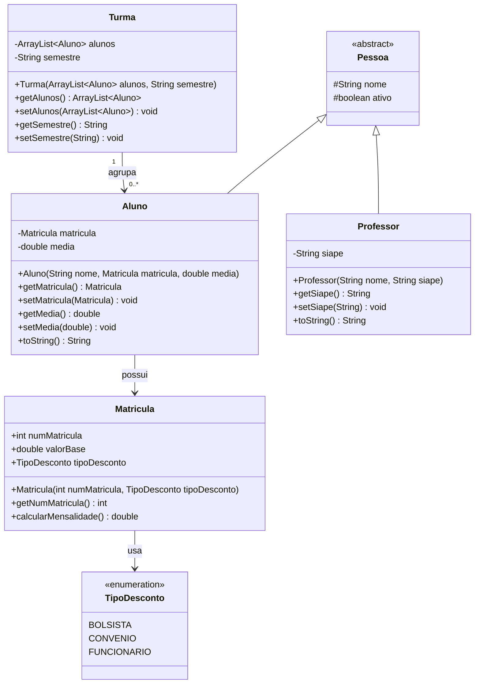

```mermaid
classDiagram
    class Pessoa {
        <<abstract>>
        #String nome
        #boolean ativo
    }

    class Aluno {
        -Matricula matricula
        -double media
        +Aluno(String nome, Matricula matricula, double media)
        +getMatricula() Matricula
        +setMatricula(Matricula) void
        +getMedia() double
        +setMedia(double) void
        +toString() String
    }

    class Professor {
        -String siape
        +Professor(String nome, String siape)
        +getSiape() String
        +setSiape(String) void
        +toString() String
    }

    class Turma {
        -ArrayList~Aluno~ alunos
        -String semestre
        +Turma(ArrayList~Aluno~ alunos, String semestre)
        +getAlunos() ArrayList~Aluno~
        +setAlunos(ArrayList~Aluno~) void
        +getSemestre() String
        +setSemestre(String) void
    }

    class Matricula {
        +int numMatricula
        +double valorBase
        +TipoDesconto tipoDesconto
        +Matricula(int numMatricula, TipoDesconto tipoDesconto)
        +getNumMatricula() int
        +calcularMensalidade() double
    }

    class TipoDesconto {
        <<enumeration>>
        BOLSISTA
        CONVENIO
        FUNCIONARIO
    }

    Pessoa <|-- Aluno
    Pessoa <|-- Professor

    Aluno --> Matricula : possui
    Matricula --> TipoDesconto : usa

    Turma "1" --> "0..*" Aluno : agrupa
```