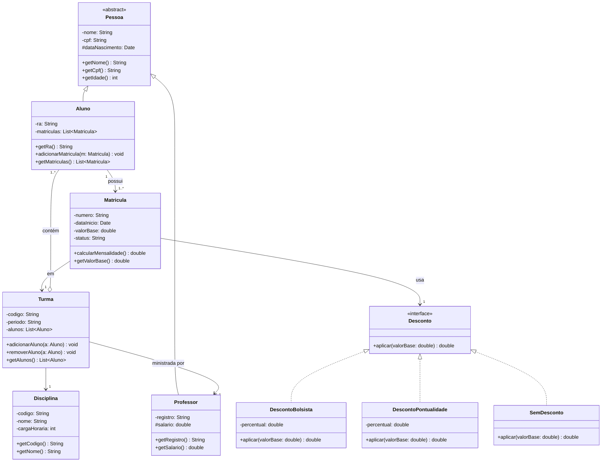
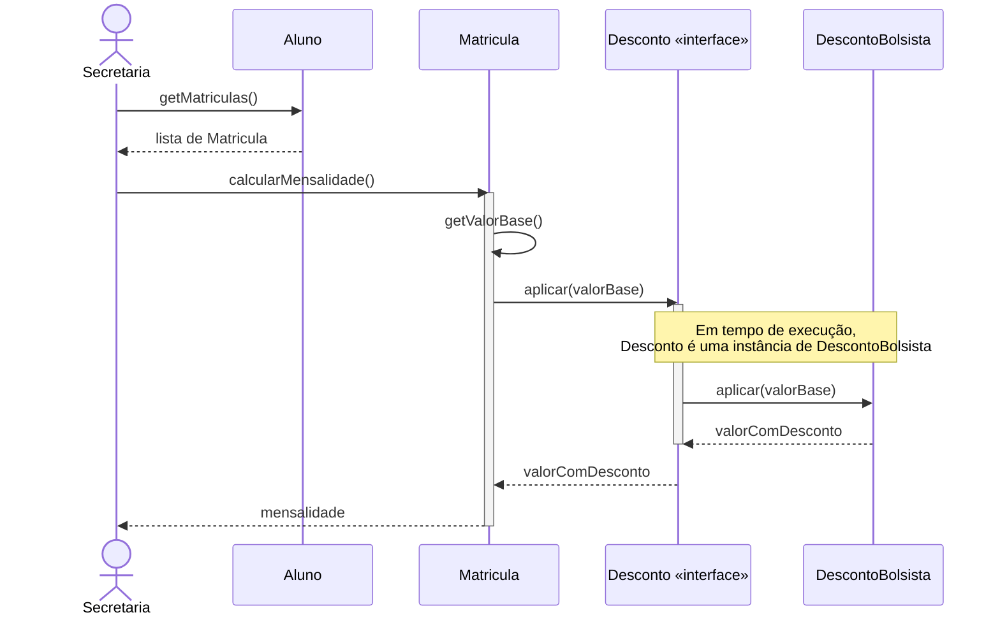

# Modelagem UML — Sistema Acadêmico

Exercício de modelagem orientada a objetos cobrindo diagrama de classes (entidades, herança, agregação, interface) e diagrama de sequência para o cálculo da mensalidade.

## Diagrama de classes

### Decisões de modelagem

| Etapa | Decisão | Justificativa |
|---|---|---|
| 1 | `Pessoa` é abstrata | Nunca existe uma "pessoa genérica" no sistema, só Aluno ou Professor. |
| 2 | Generalização `Pessoa <\|-- Aluno / Professor` | Ambos compartilham identificação e dados pessoais. |
| 3 | `Turma o-- Aluno` (agregação) | O Aluno continua existindo se a Turma for encerrada. |
| 4 | `Matricula --> Desconto` (interface) | Princípio da Inversão de Dependência: `Matricula` depende da abstração, nunca de uma implementação concreta. `SemDesconto` evita `null` (Null Object). |
| — | `Matricula` liga `Aluno` a `Turma` | A matrícula é a ponte entre o aluno e o que ele cursa, e por isso guarda `valorBase` e calcula a mensalidade. |

## Diagrama de sequência — cálculo da mensalidade

O fluxo mostra `Matricula` chamando `Desconto.aplicar()` sem conhecer qual implementação está por trás — a mesma abstração do diagrama de classes, agora vista em tempo de execução.
